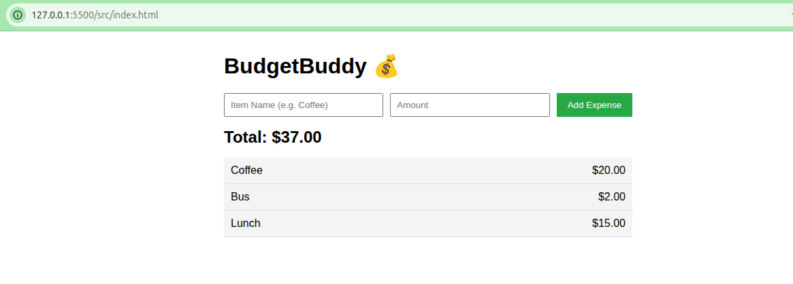

# Sprint 1: Core Expense Tracking

**Date:** 28 January, 2026

**Sprint Goal:** Deliver core expense tracking features and establish CI pipeline.

---

## Sprint Review

### 1. Delivered User Stories
| Story ID | Name | Status |
| :--- | :--- | :--- |
| Story 1 | Log Expense | ✅ Done |
| Story 2 | View Expense List | ✅ Done |
| Story 3 | View Total Spending | ✅ Done |

### 2. Evidence of Work

> The application successfully allows users to input an item name and amount. The list updates immediately, and the total is calculated correctly in the UI.

### 3. CI/CD Pipeline

> The GitHub Actions pipeline is active. The "build-and-test" job passes successfully on every push, ensuring that our `logic.js` unit tests are valid.

---

## Sprint Retrospective

**Participants:** Joel Livingstone Kofi Ackah

### What Went Well?
* **Git Workflow:** The feature branch strategy worked well. I successfully kept `main` clean and only merged working code.
* **Testing:** Writing the unit tests *before* the UI helped clarify the logic (Test-Driven Development). The Jest setup was smooth.
* **CI Setup:** The GitHub Actions pipeline caught a few potential issues early and is now running automatically.

### What Could Be Improved? (Action Items for Sprint 2)
1.  **Commit Granularity:**
    * *Issue:* In Sprint 1, I tended to do a lot of work before committing (e.g., I built the whole HTML skeleton in one go).
    * *Improvement:* In Sprint 2, I will commit more frequently—ideally after completing every single function or small UI change. This makes the history clearer.

2.  **Test Coverage:**
    * *Issue:* I only wrote tests for the "happy path" (valid inputs).
    * *Improvement:* In Sprint 2, I will add tests for "edge cases" (e.g., what happens if the list is empty? What if I add a huge number?). This improves the robustness of the app.
