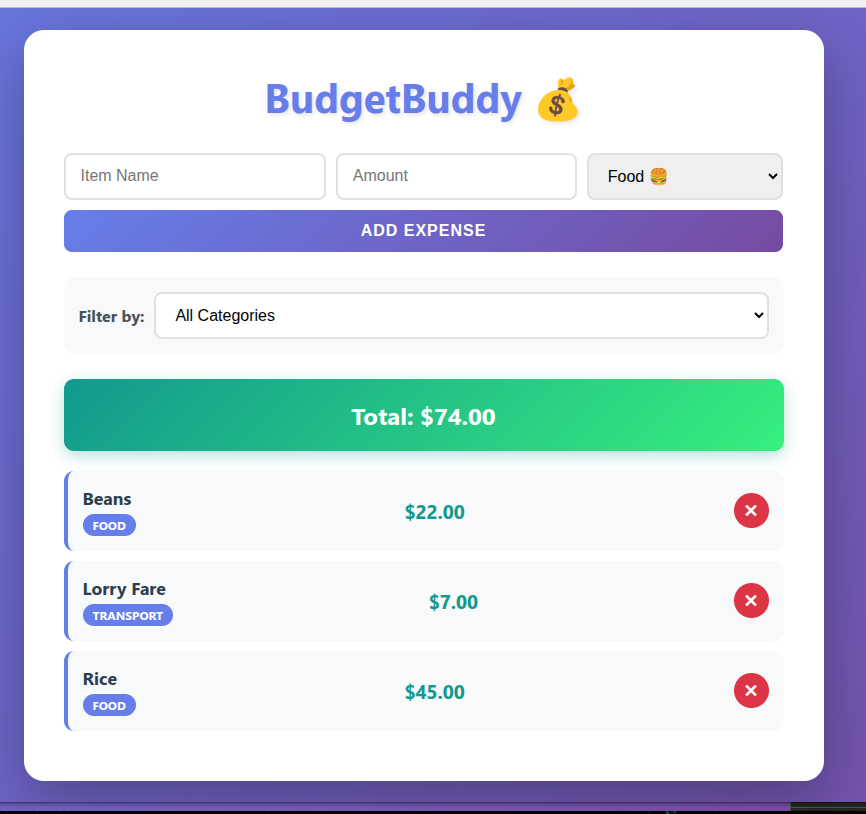
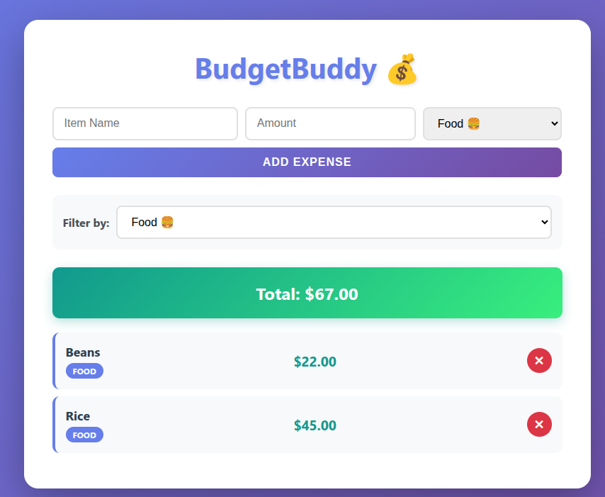
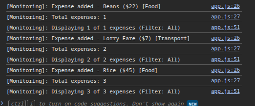
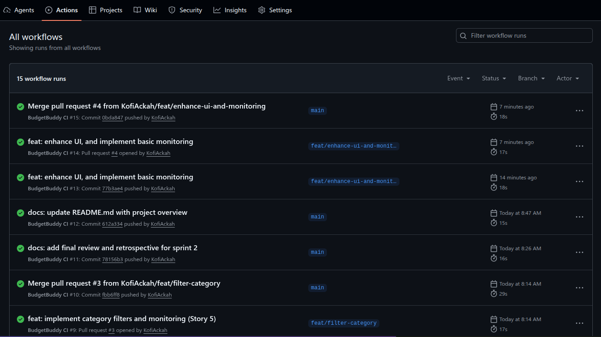

# Sprint 2: Enhanced Features & Monitoring

**Date:** 30 January, 2026

**Sprint Goal:** Apply feedback, allow deletion/filtering, and add monitoring.

---

## Sprint Review

### 1. Delivered User Stories
| Story ID | Name | Status |
| :--- | :--- | :--- |
| Story 4 | Delete Expense | Done |
| Story 5 | Filter by Category | Done |
| Task | System Monitoring | Done |

### 2. Evidence of Work

#### Application UI - All Features

> **Full Feature Set:** The modernized application displays all expenses with delete buttons, category badges, and filter dropdown. The UI features a gradient theme with responsive design and smooth animations.

#### Category Filtering in Action

> **Filtering Feature:** When "Food" filter is selected, the application dynamically displays only food-related expenses and updates the total accordingly. Notice how the total reflects only the visible filtered items.

#### Runtime Monitoring Logs

> **System Monitoring:** The browser console logs all user actions in real-time, including:
> - System startup with timestamp
> - Expense additions (name, amount, category)
> - Expense deletions (ID and name)
> - Filter changes
> - Visible vs total expense counts

### 3. DevOps & Quality

#### GitHub Actions CI/CD Pipeline

> **Automated Testing:** The GitHub Actions workflow runs on every push and pull request, automatically executing all unit tests and ensuring code quality.

* **Tests:** Unit tests cover all new logic (filtering, deleting, categories).
* **CI Pipeline:** The GitHub Actions pipeline is passing (Green)
* **Improvement from Sprint 1:** We successfully implemented TDD (writing tests before code) and committed more frequently (smaller, cleaner history).

---

## Sprint Retrospective

### What Went Well?
* **TDD approach:** Writing the test for `filterExpenses` before the function made the implementation much faster and less buggy.
* **Responsiveness:** The UI updates instantly when filtering, which feels good for the user.
* **Process Improvement:** I stuck to the "Feature Branch" workflow strictly, which kept the history clean.

### Challenges & Lessons Learned
* **State Management:** Handling the "Delete" button inside the rendered list was tricky. I learned I had to re-attach event listeners every time the list re-renders.
* **Scope Management:** Story 5 (Filtering) was larger than expected. Breaking it down into "Logic first" then "UI second" helped manage the complexity.

### Future Steps
* Create a docker image for app
* Add a database (MangoDB) for storing data
* Deploy the Docker containers to a cloud provider like AWS EC2.

### Final Project Reflection
Over the course of two sprints, I successfully built a working CI/CD pipeline. The most valuable takeaway was seeing how **Automated Tests** give you confidence to change code without breaking it.
